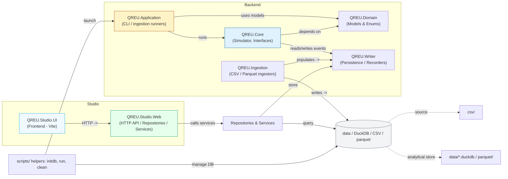

# Quantitative Backtesting Engine

## Overview
> Often i faced a problem of needing to backtest a strategy on historical data. Manual work was tedious and error-prone, therefore this is automated solution for this.

This project is a high-performance, event-driven trading simulation and backtesting framework built in modern .NET (C#). It evaluates trading strategies against historical price behaviors and custom external factors using an ultra-low-memory data streaming approach. The strategy design in this framework is based on "strategy-families", which reduces the time spent on implementing and debugging new strategies.

## Architecture

**Notes:**

- **Current entry points:** the CLI is implemented in `src/QREU.Application/Program.cs` and the HTTP API in `src/QREU.Studio.Web/Program.cs` (see their service registrations and mapped endpoints).
- The frontend in `src/QREU.Studio.UI` is a Vite app that talks to the API.
- Ingestors under `src/QREU.Ingestion` and the `scripts/` helpers populate `data/` (DuckDB/parquet) which the Studio and Core layers read.

## Key Features

- **Strategy-family design:** strategies are built from reusable family patterns, which makes it faster to prototype, compare, and refine ideas without rewriting the full execution pipeline each time.

- **Streaming data engine:** historical candles and factors are processed as a stream instead of being loaded all at once, which keeps memory usage low and makes larger datasets practical to analyze.

- **Run visualization:** every backtest run is surfaced through the Studio UI and API, turning raw execution output into explorable charts, trades, and series views that make results easier to interpret and present.

## Artifacts

- [Repository](https://github.com/tillthesky8-byte/quantitative-research-execution-unit)
- [Presentation](https://github.com/tillthesky8-byte/portfolio/tree/main/projects/backtesting-engine/original-artifacts/BIP_Presentation)