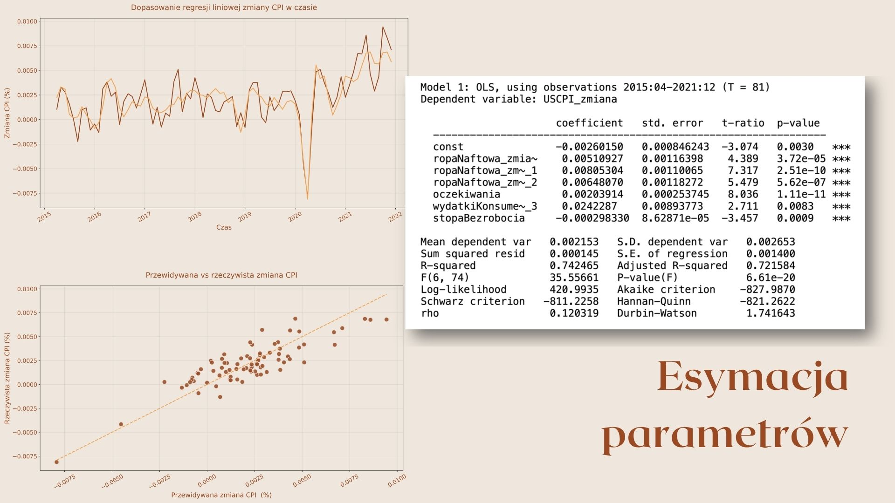

# Modeling Inflation Drivers in the United States (2015-2021)

## Overview

> Which factors contribute most to monthly inflation in the US, and how do their effects evolve over time?

This project investigates the which macroeconomic factors were most strongly associated with inflation in the United States between 2015 and 2021. The objective was to build a robust econometric model that could explain month-over-month changes in the Consumer Price Index (CPI).

## Methodology

The dependent variable is month-over-month percentage change in the US Consumer Price Index (CPI). The frequency chosen over annual or quarterly frequency to capture short-term price dynamics and allow for lag structure analysis.

**Independent variables selection** followed an economic logic rather than a data-driven search. Three transmission channels were represented explicitly:

- *Supply shocks* — percentage change in crude oil price at lags t, t−1, and t−2, motivated by the delayed pass-through of energy costs into production and transport

- *Expectation channel* — University of Michigan Consumer Sentiment Survey (monthly), capturing forward-looking price-setting behavior by firms

- *Demand pressure* — percentage change in consumer expenditure at lag t−3, and unemployment rate level as a Phillips curve proxy

**Estimation** used OLS on 81 monthly observations (April 2015 – December 2021). Prior to estimation, a correlation matrix was examined to assess multicollinearity between regressors; no problematic pairs were identified among the final specification.

**Diagnostic testing** covered four classical OLS assumptions:

| Test          | Target                      | Result                             |
|---------------|-----------------------------|------------------------------------|
| Bera-Jarque   | Normality of residuals      | χ²= 1.83, p = 0.40 — not rejected  |
| Durbin-Watson | First-order autocorrelation | DW = 1.74 — inconclusive zone      |
| Ljung-Box     | First-order autocorrelation | Q = 1.19, p = 0.275 — not rejected |
| White         | Homoskedasticity            | TR²= 25.9, p = 0.52 — not rejected |

The DW statistic fell within the inconclusive region (dL = 1.48 < DW < dU = 1.80), but the Ljung-Box test independently confirmed no first-order autocorrelation. All remaining assumptions were satisfied, supporting the validity of standard inference on the estimated coefficients.

## Key Findings

All six regressors were statistically significant at α = 0.05, both individually (t-test) and jointly (F = 35.6, p = 6.61e-20). The model explained **74.2% of monthly CPI variance** — a strong result for high-frequency macroeconomic data over a period that included the COVID-19 oil price shock.

  

**Oil price transmission is delayed, not immediate.**
The contemporaneous oil price change contributes ~0.51 p.p. to CPI, while the t−1 and t−2 lags contribute ~0.80 and ~0.64 p.p. respectively. The lagged effects are stronger than the current-period effect — consistent with the time needed for energy cost increases to propagate through production chains and reach consumer prices.

**Inflation expectations are the single strongest predictor.**
The Michigan Consumer Survey variable carried both the highest bivariate correlation with CPI (r = 0.597) and the strongest t-statistic in the model (t = 8.04, p = 1.11e-11) — outperforming all three oil price lags. This quantifies the self-fulfilling component of inflation: when firms expect prices to rise, they raise prices.

**The Phillips curve relationship holds.**
The unemployment rate enters with a negative coefficient (−0.000298), consistent with theory, and is statistically significant (p = 0.0009). The coefficient is small because I didn't apply a normalization of the variable at the time, but the sign and significance confirm that labor market slack still exerts downward pressure on prices, even in a high-inflation environment.

**The 2020 oil shock is a visible outlier, not a model failure.**
Scatter plots reveal extreme observations on both tails of the oil price distribution, corresponding to the ~60% collapse and subsequent ~90% rebound in crude prices during 2020. These pull the fitted line but do not invalidate it — the underlying relationship is cleaner within normal price variation ranges.

## Artifacts
- [Full presentation (in Polish)](https://github.com/tillthesky8-byte/portfolio/tree/main/projects/inflation-model/original-artifacts/CPI_model_prezentacja)
- [Dataset](https://github.com/tillthesky8-byte/portfolio/blob/main/projects/inflation-model/original-artifacts/dane.csv)
- [Complete research paper (in Polish)](https://github.com/tillthesky8-byte/portfolio/blob/main/projects/inflation-model/original-artifacts/projekt37-2.pdf)           