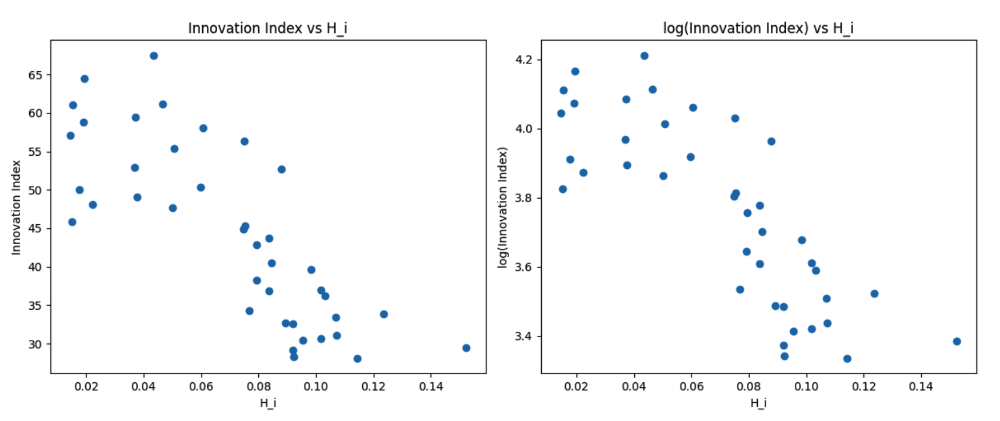
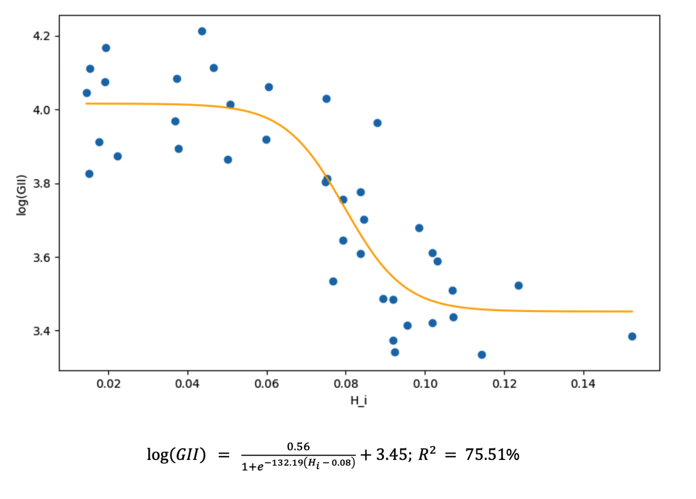

# Psychological Burden Index & Innovation Analysis

## Overview
> How to measure the psychological burden of a country, and does it correlate with its innovation capacity?

This project constructs a synthetic index of psychological burden across countries using Hellwig's linear ordering method, then investigates its relationship with national innovation capacity. Variable selection deliberately avoided self-reported survey data in favor of indirect behavioral and health indicators, reducing response bias inherent to psychological research.

## Methodology

**Variable selection** prioritized indirect indicators over self-reported ones. The core argument: chronic stress distorts self-assessment, making direct survey responses unreliable as a measure of the very phenomenon they attempt to capture. Four proxy variables were selected on the basis that chronic stress is a shared underlying factor:

- *Cardiovascular disease incidence* — heart disease and stroke cases per 100,000 population
- *Average sleep duration* — in minutes, as a behavioral proxy for chronic stress load
- *Uncertainty Avoidance Index (UAI)* — Hofstede's cultural dimension reflecting societal risk tolerance, itself partly shaped by collective anxiety levels

**Collinearity correction**. A strong correlation (r = 0.66) 
between heart disease and stroke incidence raised a practical concern: both variables likely 
reflect the same underlying process — chronic cardiovascular stress — meaning an unweighted 
composite would count that process twice. 

Rather than applying equal weights or adopting a standard scheme from the literature, the 
weighting formula was derived from scratch: penalize each variable proportionally to how 
correlated it is with the others. The result — dividing 1 by the sum of absolute pairwise 
correlations — naturally assigns lower weight to variables that share variance with their 
neighbors, and higher weight to those carrying independent information.

As i see it now, this approach is not formally optimal, but the reasoning behind it is sound and the 
derivation was independent. Sleep duration received the highest weight (0.42) precisely 
because it was the least correlated with the remaining variables — which also happens to 
align with its theoretical role as a direct behavioral proxy for chronic stress. Weights were derived as:

$$b_j = \frac{1}{\sum|r_{jk}| - 1}$$

then normalized to sum to 1, yielding the following weight distribution:

| Variable       | Weight |
|----------------|--------|
| Sleep duration | 0.42   |
| UAI            | 0.27   |
| Heart disease  | 0.16   |
| Stroke         | 0.15   |

**Index construction** followed Hellwig's linear ordering method (TMR), producing a synthetic measure Hᵢ ∈ [0, 1] where higher values indicate greater psychological burden.

**Regression modeling** of the Hᵢ–GII relationship began with a scatter plot inspection. The raw GII showed heteroskedasticity at higher values, addressed by log transformation. The resulting log(GII) vs. Hᵢ scatter revealed a non-linear, threshold-shaped relationship — not a gradient — motivating a sigmoid fit:

$$y = \frac{L}{1 + e^{-k(x - x_0)}} + b$$

Parameters were estimated via non-linear least squares.

---

## Key Findings

### **The relationship with innovation is non-linear.**
A linear model would misrepresent the data. Innovation capacity drops sharply as Hᵢ crosses approximately 0.08, then flattens at both extremes — high-burden and low-burden countries show less sensitivity to marginal changes than mid-range ones. The sigmoid captures this with R² = 75.5% and an inflection point estimated at Hᵢ = 0.080 ± 0.003.

  

---

### **The interpretation is asymmetric.**
Good mental health does not generate innovation — it enables it. Countries below the threshold can innovate; countries above it face a structural drag that other factors struggle to compensate for. This framing is supported by the shape of the curve: the ceiling at low Hᵢ is diffuse, while the floor at high Hᵢ is steep.

  

---

At the end wanted to add sigmoid shape is evidence against confounding argument. If the relationship were primarily driven by wealth (better economy → better healthcare → lower Hᵢ, and better economy → more innovation), you'd expect a smoother, more linear or even exponential curve — richer countries uniformly more innovative. Instead you get a threshold: below Hᵢ ≈ 0.08 the curve flattens, meaning additional reductions in burden don't produce proportionally more innovation. That's inconsistent with a pure wealth-driven story.

The shape itself encodes the causal mechanism. A sigmoid implies a bottleneck being removed, not a resource being added. That's what "enabling rather than causing" looks like mathematically. If mental health were a direct input to innovation output the way capital or R&D spending is, you'd see a different functional form.

## Artifacts

- [Full Paper](https://github.com/tillthesky8-byte/portfolio/blob/main/projects/psychological-burden-index/original-artifacts/analiza%20danych0.pdf)
- [Excel Workbook](https://github.com/tillthesky8-byte/portfolio/blob/main/projects/psychological-burden-index/original-artifacts/analiza%20danych.xlsx)